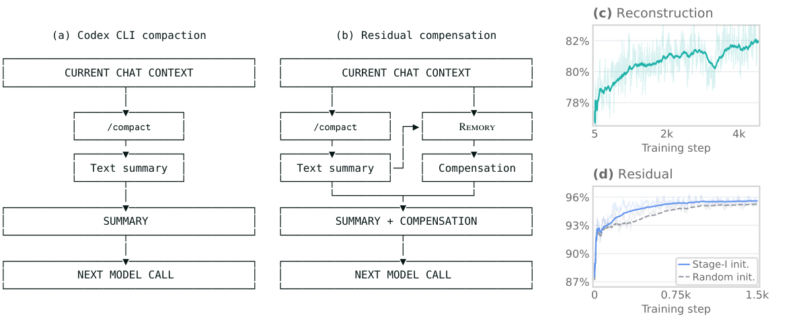
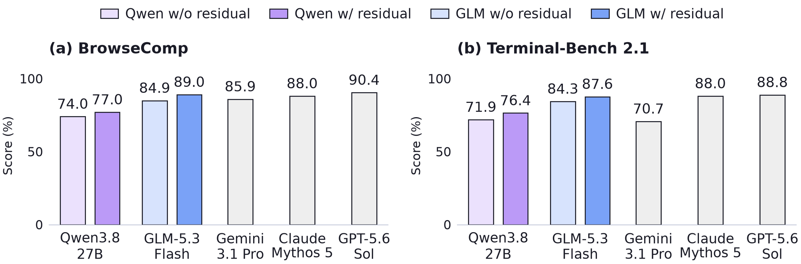

# Remory: Learning Residual Memory for Context Compaction

**Remory** supplements an agent's compaction summary with learned soft memory
from its history. The memory is conditioned on the summary and appended after
it, helping the frozen model continue its work across compactions.

[📄 **Paper**](https://arxiv.org/pdf/2610.11287) |
[💻 **Code**](https://github.com/1ring2rta/Remory) |
[🤗 **Models**](#models)

https://github.com/user-attachments/assets/62831257-f2cf-4f98-aabc-95b750d5eae3

<sub>Music: <a href="https://www.scottbuckley.com.au/library/electric-dreams/">Electric Dreams</a> by Scott Buckley · <a href="https://creativecommons.org/licenses/by/4.0/">CC BY 4.0</a> · <a href="assets/README.md#demo">Edit details</a></sub>



## Models

| Base model | Memory checkpoint | Deployment |
| --- | --- | --- |
| Qwen3.8-27B | [Qwen3.8-27B-REMORY-1.9B](https://huggingface.co/mocoV3/Qwen3.8-27B-REMORY-1.9B) | SGLang, Transformers |
| GLM-5.3-Flash | [GLM-5.3-Flash-REMORY-1.24B](https://huggingface.co/mocoV3/GLM-5.3-Flash-REMORY-1.24B) | Weights available; GLM integration required |

The GLM release is the 1.24B checkpoint used in local evaluations, distinct from
the 1.502B encoder described in the paper. The quick start below supports Qwen.

## Quick Start

Plan for **at least 2 × 80 GB GPUs** to deploy **Qwen3.8-27B + Remory** with
SGLang. The command below loads both models and serves generation and compaction
through one endpoint. See [deployment](docs/deployment.md) for more options.

### 1. Install

```bash
git clone https://github.com/1ring2rta/Remory.git
cd Remory
python deploy/install.py
source .remory/venv/bin/activate
```

The installer prepares a local environment with the pinned SGLang version,
Remory hook, and CUDA compiler components.

### 2. Launch SGLang with Remory

```bash
CUDA_VISIBLE_DEVICES=0,1 python -m remory.launch_server \
  --model-path Qwen/Qwen3.8-27B \
  --remory-checkpoint mocoV3/Qwen3.8-27B-REMORY-1.9B \
  --tp 2 \
  --host 127.0.0.1 \
  --port 8421
```

`--tp 2` splits the LLM across the two GPUs; each worker also loads Remory.
The context window defaults to the model maximum (256K for Qwen3.8-27B).
The first run downloads weights and compiles GPU kernels.

### 3. Generate and compact

```bash
curl http://127.0.0.1:8421/generate \
  -H 'Content-Type: application/json' \
  -d '{"text":"The capital of France is", "sampling_params":{"temperature":0,"max_new_tokens":16}}'
```

In another terminal, run the full compaction example from the repository root:

```bash
source .remory/venv/bin/activate
python examples/quickstart.py
```

The example generates an answer, creates a summary and residual memory, then
continues from that checkpoint. All model calls use the same SGLang `/generate`
endpoint. During residual encoding, the Remory hook reads the actor's hidden
states and runs the memory network. During continuation, it inserts the saved
soft tokens after the summary.

## Replace compact

[`Harness.compact`](src/remory/adapters/harness.py) is the compaction method to
connect to your agent: generate a summary, encode residual memory, then return
the new checkpoint. The agent retains its own tools and compaction trigger.

```python
from remory.adapters import Harness
from remory.client import Client

with Client("http://127.0.0.1:8421", session_id="my-session") as client:
    agent = Harness(client, codec)  # The actor's native chat template
    checkpoint = agent.compact(
        prefix_messages=prefix,    # System prompt, tools, and original task
        removed_messages=history,
        summary_prompt=summary_prompt,
        summary_schema=summary_schema,
    )
    result = agent.generate(
        checkpoint=checkpoint, prefix_messages=prefix, messages=new_messages,
    )
```

The [complete example](examples/quickstart.py) loads the tokenizer and summary
prompt from the released checkpoint. If your harness already generates a
summary, use `on_compact(..., summary=summary)` to add residual memory.

Save the checkpoint with the conversation. For the next compaction, pass it as
`previous` and supply the newly removed history. Memory is stored in
`.remory/memory.sqlite`. The [Codex example](integrations/codex) shows where to
override a Responses provider's compact handler and resume generation.
See the [API reference](docs/api.md) for native SGLang requests with memory.

## Results



Qwen3.8-27B and GLM-5.3-Flash improve across long-horizon agent benchmarks.
Residual memory also reduces repeated tool outputs and tool errors on BrowseComp
and Terminal-Bench 2.1. On SummHay, it approaches the full-context joint score
using 5.2% of the input positions.

Gray bars show published frontier results under their respective evaluation
protocols. Full results and settings are in the [paper](https://arxiv.org/pdf/2610.11287).

## Acknowledgements

The Qwen memory network builds on [DFlash](https://github.com/z-lab/dflash)
and [SpecForge](https://github.com/sgl-project/SpecForge).
Inference uses [SGLang](https://github.com/sgl-project/sglang)
and [Transformers](https://github.com/huggingface/transformers).

## Citation

```bibtex
@misc{xia2026remory,
  title  = {Remory: Learning Residual Memory for Context Compaction},
  author = {Xia, Hanchen and Chen, Baoyou and Ge, Yutang and Deng, Naihao and
            Yang, Senqiao and Dong, Zilong and Yuan, Weihao and Zhu, Siyu},
  year   = {2026},
  eprint = {2610.11287},
  archivePrefix = {arXiv},
  primaryClass = {cs.CL},
  url    = {https://arxiv.org/abs/2610.11287}
}
```

[Development](docs/development.md) · [MIT License](LICENSE) · [Third-party notices](THIRD_PARTY_NOTICES.md)
